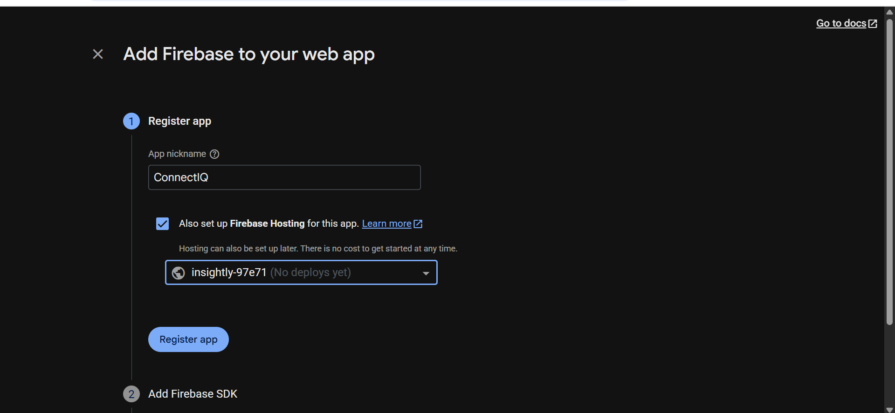
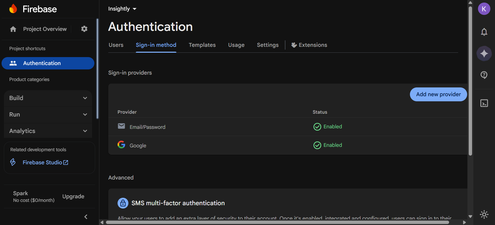
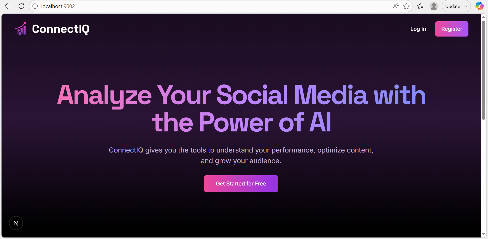
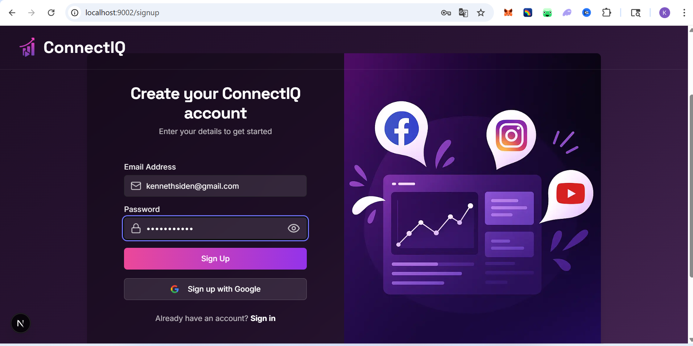
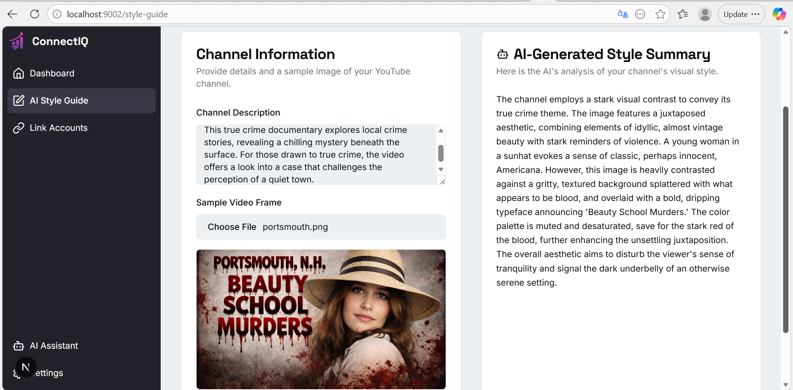
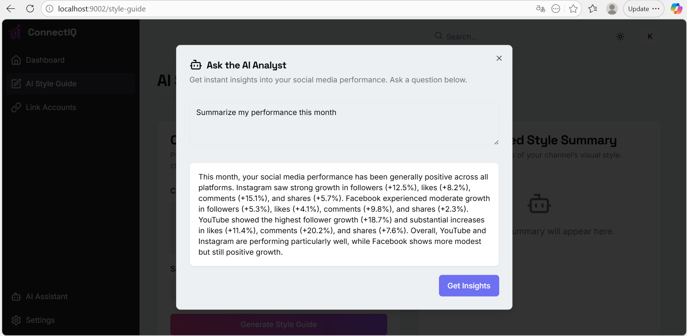
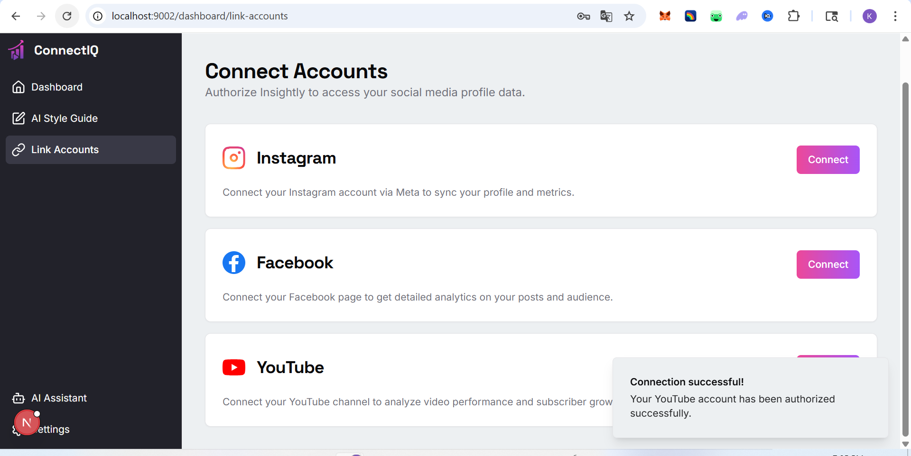
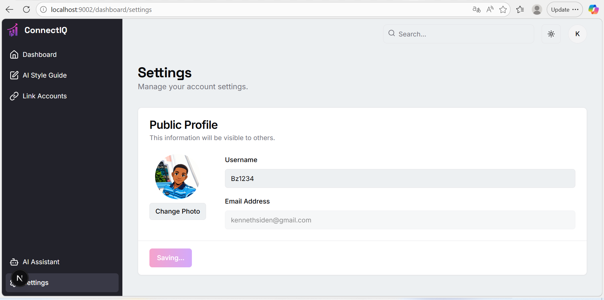

# ConnectIQ – AI-Powered Social Media Analytics Dashboard

**ConnectIQ** is a modern platform that centralizes and visualizes social media metrics from **Instagram, TikTok, Facebook, and YouTube** in one intelligent dashboard, enhanced with **AI-powered insights**.

Built for **content creators, brands, and agencies** who want to understand, analyze, and optimize their social media performance.

---

## 🚀 Live Demo

🔗 https://connect-iq-five.vercel.app/

---

## 🧠 Key Features

- 🔐 Secure authentication with **Firebase Authentication**
- 📧 Email & Password authentication
- 🔑 Google Sign-In integration
- 🔗 Connect multiple social media platforms
- 📊 Real-time analytics dashboard (followers, engagement, growth)
- 🧠 AI-powered insights and summaries
- 📅 Weekly and monthly performance comparison
- 🌙 Responsive UI with Dark Mode support

---

## 🛠️ Tech Stack

| Technology | Purpose |
|---------|--------|
| **Next.js 15 (App Router)** | Frontend framework |
| **TypeScript** | Type safety |
| **Firebase** | Auth, Firestore, Hosting |
| **Tailwind CSS** | Styling |
| **Recharts** | Data visualization |
| **Google Gemini / OpenAI** | AI-powered analysis |
| **Meta API** | Instagram & Facebook data |
| **OAuth 2.0** | Secure social login |

---

## 🔐 Authentication (Firebase)

### Supported Methods
- Email & Password
- Google Sign-In

### Firebase Setup Screenshots

#### 1️⃣ Create Firebase Project


#### 2️⃣ Enable Authentication Providers


---

## 📸 Application Screenshots

### Landing Page


### Signup Page


### AI Style Guide Page


### AI Style Guide Analyst


### Link Accounts



### Settings



---

## 🧪 Local Installation

1. Clone the repository:

```bash
git clone https://github.com/BlessedSiden1234/connectIQ.git
cd connectiq
```

2. Install dependencies:

```bash
npm install
# or
yarn install
```

3. Create a `.env.local` file:

```env
NEXT_PUBLIC_FIREBASE_API_KEY=your_key
NEXT_PUBLIC_FIREBASE_AUTH_DOMAIN=your_domain
NEXT_PUBLIC_FIREBASE_PROJECT_ID=your_project_id
NEXT_PUBLIC_FIREBASE_APP_ID=your_app_id
GEMINI_API_KEY=your_ai_key
```

4. Run the development server:

```bash
npm run dev
```

---

## 📁 Project Structure

```
src/
├─ app/                # Next.js App Router pages
├─ components/         # Reusable UI components
├─ hooks/              # Custom hooks
├─ lib/                # Firebase & utilities
├─ ai/                 # AI flows & prompts
├─ styles/             # Global styles
├─ types/              # TypeScript types
```

---

## 🛣️ Roadmap

- [x] Project setup with Next.js & Firebase
- [x] Authentication (Email & Google)
- [x] Protected routes
- [x] Dashboard UI
- [x] AI Style Guide feature
- [x] YouTube API integration
- [x] Meta API integration
- [x] Advanced AI analytics
- [x] Multi-account support
- [x] Production deployment

---

## 🌐 Deployment

Planned deployment platforms:

- **Vercel** – Frontend hosting
- **Firebase Hosting** – Alternative hosting
- **Firestore** – Scalable database

---

## 🤝 Contributing

Contributions are welcome!

1. Fork the repository
2. Create a new branch:
```bash
git checkout -b feature/new-feature
```
3. Commit your changes:
```bash
git commit -m "Add new feature"
```
4. Push to your branch:
```bash
git push origin feature/new-feature
```
5. Open a Pull Request 🚀

## 👤 Author

**Blessed Siden**  
GitHub: https://github.com/BlessedSiden1234

> This project was built for professional and educational purposes to showcase modern full-stack development skills.
